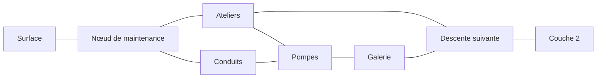

# Première couche : une expédition entre deux profondeurs

**Date :** 27 septembre 2026.

**Statut :** plan et passages intégrés en génération 118 ; terrains locaux, annexes et raccourci en 119 ; première répartition des groupes par lieu en 120. Les essais comparatifs et leurs limites sont consignés dans [Essais de la première couche](ESSAIS_PREMIERE_COUCHE.md). Les intitulés des régions décrivent leur fonction, sans fixer de nouveaux noms propres. Cette tranche n'est pas encore une couche équilibrée ni une campagne.

## But de cette tranche

Faire de la première couche souterraine un territoire à parcourir : préparer une sortie en ville, choisir un chemin, découvrir un lieu facultatif, décider de poursuivre ou de rentrer, puis trouver la descente suivante. Il ne faut ni accepter une quête de démonstration, ni nettoyer tous les ennemis pour progresser.

Périmètre proposé : la ville existante et cinq régions extérieures structurantes, avec deux itinéraires garantis, deux destinations facultatives et une liaison entre les itinéraires. Ce n'est pas une limite à l'atlas explorable ni le gabarit obligatoire des couches suivantes.

### Direction confirmée : un territoire ouvert, pas un circuit imposé

Les deux itinéraires servent de garantie de génération et de support aux essais. Ils ne constituent ni les seuls chemins autorisés, ni un choix de parcours présenté au joueur. Les régions alentour restent explorables et les retours restent possibles. La géographie se découvre depuis le terrain, les repères et les indications obtenues dans le monde.

La couche doit aussi accueillir des destinations ayant un intérêt propre, sans toutes converger vers la prochaine descente. Les deux annexes sont un premier essai de contenu facultatif, pas une preuve suffisante de cette richesse. Le petit circuit permettra de valider les passages et les ressources ; il ne suffira pas à déclarer l'exploration de la couche aboutie. Les couches suivantes ne doivent pas reproduire systématiquement le modèle « ville, chemin court, chemin long, sortie ».

## Règle d'équilibrage confirmée : ne pas exiger un bon tirage

L'équipement étant aléatoire, explorer la surface plus longtemps ne garantit pas une meilleure arme. Les abords de la première couche doivent être abordables avec un équipement ordinaire, sans affixe ni effet particulier requis. Les bons tirages donnent un avantage ; ils ne constituent pas un prérequis caché.

La préparation peut apporter des compétences, des consommables et une meilleure connaissance du jeu. Elle ne doit pas imposer d'attendre un butin favorable. Les essais doivent couvrir un kit sans bonus puis des tirages variés, y compris médiocres, en conservant les échecs. Il faut distinguer la reconnaissance avec possibilité de repli de l'expédition complète jusqu'à la ville suivante : aucun de ces contrats ne signifie que tous les combats doivent être gagnables.

Cette règle est une cible de conception approuvée, pas une déclaration d'équilibre atteint. Les résultats difficiles avec le petit kit ne sont pas invalidés au motif que le joueur aurait pu trouver mieux.

## Ce que le jeu possède déjà

État avant la génération 118, vérifié au 27 septembre :

- Le **Nœud de maintenance**, en `(-1, 0, 1)`, dispose déjà de son plan, de ses habitants et de services ordinaires. On conserve cette ville.
- Les cinq villes profondes sont encore reliées par un même puits. Le lien direct entre `(-1, 0, 1)` et `(-1, 0, 2)` permet actuellement de sauter l'exploration de cette couche.
- Les passages verticaux sont déclarés séparément des villes. Les accès urbains sont construits et vérifiés à partir des liens déclarés : une ville n'a pas besoin de posséder une descente.
- Les régions, passages, rencontres et ressources disposent déjà d'une génération déterministe et d'une persistance. Le contrat général de réservation des lieux à l'échelle d'une couche reste à construire.
- La distribution de version 117 propose maintenance et production à cette profondeur. Leurs rencontres fournissent déjà une base ; cette tranche ne demande pas d'inventer un nouveau bestiaire.

Sources : [monde régional](../content/core/regional_worlds/simulation.json5), [définitions et validation](../src/content/regional_world.rs), [génération des destinations](../src/test_regional.rs).

## Organisation proposée

Le schéma montre des connexions réversibles, pas une suite de missions. Les positions et les aménagements locaux pourront varier entre parties.

- **Trajet court : ville → ateliers → descente.** Moins de régions, mais des traversées exposées et des positions ennemies à lire avant de s'engager.
- **Contournement : ville → conduits → pompes → galerie → descente.** Davantage d'abris et de possibilités de rupture de vue, mais une sortie plus longue, avec ses propres dangers et dépenses.
- **Liaison ateliers–pompes :** changer de route après une découverte ou un combat, sans devoir rentrer en ville.

Le contournement ne doit pas devenir la route objectivement supérieure : il coûte du temps et des ressources, et ses passages humides ont leurs occupants. Les autres voisins de l'atlas restent accessibles ; on garantit ces deux chemins sans enfermer le joueur dans un couloir invisible.

Ces termes décrivent les essais de conception, pas des étiquettes d'interface. Un détour doit offrir une raison concrète d'être tenté : matériel, approche adaptée au personnage, découverte ou raccourci durable pendant la partie. Des indices peuvent annoncer la nature d'un lieu ou d'un danger sans révéler son contenu exact ni toute la carte. La longueur n'est jamais une récompense ; si le détour ne justifie pas son coût en jeu, réduire sa longueur ou retravailler son contenu.

### Rôle des régions

| Région | Lecture du lieu et choix tactique | Intérêt d'exploration |
|---|---|---|
| Ateliers | Halles, machines et cloisons brisées. Des lignes de tir franches, avec des abris latéraux permettant l'approche ou le repli. | Un magasin annexe facultatif contenant un tirage d'équipement du niveau local. Son existence ne garantit ni bonus ni objet adapté au personnage. |
| Conduits | Chemins secs entre zones humides, angles et petits élargissements. Alterner contournement et passage direct. | Découvrir une approche moins exposée ; conserver des espaces calmes, sans combat imposé à chaque virage. |
| Pompes | Bassins et plateformes reliés par plusieurs passages. Le territoire d'un Ver cuirassé peut rendre le trajet direct moins intéressant. | Une réserve de service facultative fournit des consommables existants. Accès par un détour sec ou par une approche plus courte exposée au danger. |
| Galerie | Espace de transition avec vues plus longues et refuges espacés. Observer avant de quitter un abri. | Rejoindre l'accès final depuis le contournement, avec une possibilité réelle de revenir vers les pompes. |
| Descente | Un repère reconnaissable et plusieurs approches locales ; pas une arène à nettoyer obligatoirement. | Accéder à la couche 2 et pouvoir remonter par le même passage. |

Le magasin et la réserve sont des annexes **dans** les régions, pas deux cartes supplémentaires à traverser. Les récompenses sont prises sur le budget de butin régional, pas ajoutées systématiquement à toutes les caches existantes. Aucun objet de quête, ressource d'artisanat ou nouveau système d'amélioration n'est requis.

Le raccourci local des ateliers est intégré en 119 : une commande intérieure déverrouille la porte occidentale de l'annexe. L'entrée orientale reste libre ; le joueur n'a pas besoin du raccourci pour atteindre le matériel. Son ouverture réduit le retour vers le passage ouest de la région. Ni téléportation, ni porte verrouillant la progression principale. Son intérêt selon le côté d'arrivée devra être évalué pendant les essais de parcours.

## Rencontres et ambiance

La couche reste lisible comme une infrastructure matérielle usée : ateliers, conduites, végétation ou faune dans les espaces abandonnés, présence humaine et machines selon les profils existants. Les logiques franchement numériques des grandes profondeurs ne doivent pas envahir cette première étape.

- Employer les rôles de poursuite et d'escarmouche déjà présents pour faire varier les approches, sans les empiler systématiquement.
- Placer le Ver cuirassé dans son habitat compatible, à distance des arrivées ; son attaque annoncée et son territoire donnent une décision de déplacement.
- Une Riveuse peut occuper un poste de travail lorsque le tirage la retient. Sa neutralité et son interaction restent respectées : sa présence n'impose pas un combat et ne transforme pas les autres habitants en robots.
- Ne pas importer le Guetteur, le Spectre ou d'autres ennemis plus profonds pour remplir ces régions.
- Une rencontre composée remplace une part des tirages ordinaires et consomme le budget existant. Elle ne se superpose pas gratuitement à toute la population aléatoire.
- Conserver des abords de passage dégagés et des espaces sans hostilité. Ne pas relever globalement les PV ou l'armure pour allonger la sortie.

Les services ordinaires restent accessibles sans réputation ni mission obligatoire. Les règles de butin selon le type d'ennemi, la mort définitive et l'absence de recharge gratuite au changement de région ne changent pas.

## Fixer les fonctions, faire varier le terrain

**Garantir :** la ville, la descente, les deux itinéraires, leur liaison, les deux annexes et des accès physiquement praticables. Les lieux existent avant toute acceptation de quête.

**Faire varier :** orientation du dispositif, plans locaux, abris, chemins secondaires, situations compatibles et récompenses. Les intérieurs ne doivent pas se réduire au déplacement de coffres sur une même carte.

Les rôles de lieu auront des identifiants stables distincts de leurs noms affichés. Une graine dédiée au plan évitera qu'un changement de butin déplace la descente. L'ordre des visites et une suspension ne doivent rien redistribuer.

Les biomes ordinaires sont cohérents à l'échelle des provinces : ne pas supposer qu'on peut tirer librement un biome différent pour chaque case de ce schéma. Le premier lot devra déclarer explicitement les aménagements réservés et leur compatibilité avec maintenance/production, sans modifier silencieusement la distribution globale de version 117.

Le plan interne ne révèle pas la carte au joueur. Repères, issues et lieux découverts suivent la perception et l'exploration habituelles ; aucun marqueur ne livre les occupants ou le butin encore inconnus.

## Déplacer la descente sans déplacer toutes les villes

### Prévoir la future quête d'ouverture

Direction confirmée : une future quête guidera vers la sortie et permettra de lever un obstacle cohérent avec le monde, éventuellement en plusieurs étapes. Il ne s'agit pas d'atteindre un nombre arbitraire de quêtes terminées. La nature de l'obstacle, les personnages et les moyens de résolution restent à définir ; aucun exemple de panne, porte ou autorisation n'est adopté comme scénario définitif.

Le contrat des accès devra distinguer la présence du passage de sa disponibilité :

- Le lieu et la sortie existent et peuvent être découverts avant d'accepter la quête.
- Une éventuelle condition d'ouverture dépend de faits persistants du monde, pas du seul fait d'avoir accepté une mission ou parlé au donneur de quête.
- Une action déjà accomplie qui satisfait effectivement la condition est reconnue, sans répétition imposée après acceptation.
- Le motif du blocage est compréhensible sur place. Les moyens de le résoudre ne doivent pas tous se trouver derrière le passage bloqué.
- L'ouverture reste acquise au retour et après suspension. Le verrou ne doit pas empêcher d'explorer la couche ni de rentrer en ville.

Pour la première tranche technique, aucun verrou narratif n'est activé : le passage reste utilisable afin de tester les trajets. Prévoir une condition facultative dans la conception ne demande ni de créer une fausse quête, ni de choisir dès maintenant son modèle de données. L'intégration ultérieure du verrou devra respecter les anciennes parties ; elle ne peut pas les bloquer rétroactivement sans contrat de compatibilité explicite.

### Placement du passage

Exemple de placement de référence, relatif à la ville :

| Rôle | Décalage régional `(x, y)` |
|---|---|
| Ville | `(0, 0)` |
| Ateliers | `(1, 0)` |
| Descente | `(2, 0)` |
| Conduits | `(0, 1)` |
| Pompes | `(1, 1)` |
| Galerie | `(2, 1)` |

Toutes les connexions dessinées sont cardinales. Une rotation ou une symétrie autour de la ville pourra varier l'implantation selon la graine, en respectant les réservations et les limites du monde.

Pour une nouvelle génération :

1. Conserver l'accès surface–ville de couche 1 et les villes existantes.
2. Remplacer le seul lien vertical direct ville 1–ville 2 par celui du lieu de descente réservé. Son arrivée en couche 2 partage les mêmes coordonnées horizontales, conformément au contrat actuel.
3. Réserver aussi un accès praticable entre cette arrivée et la **Couronne de refroidissement**, toujours en `(-1, 0, 2)`. Cette approche bornée fait partie du lot : déplacer seulement l'escalier supérieur serait incomplet.
4. Ne pas remanier les descentes des couches suivantes dans cette tranche.
5. Adapter les indications de navigation aux passages réels plutôt qu'à l'ancien puits urbain.

Les parties déjà suspendues conservent leurs anciens liens, empreintes et destinations, y compris ceux des régions non visitées. Le nouveau contrat porte le numéro 118 ; les générations 117 et antérieures retirent uniquement les métadonnées de ce plan avant leurs projections de compatibilité existantes.

### Premier lot intégré — génération 118

- `first_layer_plan` est une option explicite du monde régional, référençant les deux villes existantes. Les mondes sans cette option gardent leurs passages déclarés.
- Le modèle de première couche réserve six rôles stables, les deux trajets, leur liaison et trois régions d'approche en couche 2, ville comprise. Une graine indépendante choisit parmi huit rotations/symétries compatibles avec les bornes, villes et passages déjà présents.
- Seul le lien vertical 1 → 2 est déplacé. Les villes ne bougent pas ; surface → ville 1 et les liaisons plus profondes restent intactes. Toutes les connexions cardinales ordinaires restent disponibles.
- Le catalogue déclaré reste la référence d'empreinte. Une copie résolue pour la graine fournit les passages effectifs à la génération locale et à la navigation. Le plan se reconstruit à l'identique depuis la graine et la version ; il ne change pas à chaque nouvelle visite et ne dépend pas de l'acceptation d'une quête.
- Les accès souterrains ne sont indiqués localement qu'après exploration de leur case. La direction distante vers une descente n'est proposée qu'après l'avoir franchie, par des régions visitées : le plan interne ne sert pas de boussole omnisciente. Le guidage d'introduction en surface reste inchangé.
- Aucun verrou narratif, nouveau butin, ennemi ou bonus de jauge n'est ajouté. Les régions réservées utilisent encore leurs terrains et populations ordinaires de maintenance/production ; leur identité locale décrite plus haut constitue le prochain lot.

Ce modèle borné n'est pas le système général de dépendances narratives de toutes les couches. Chaque couche devra avoir son propre enjeu de progression, sans imposer partout une quête d'ouverture ni répéter cette géométrie.

Les quatre tests de `first_layer_plan_tests` passent : stabilité et connexions sur 128 graines, rejet des références invalides, génération complète des six régions et de l'approche sur huit graines (72 cartes), puis aller-retour via les deux itinéraires avec reprise par cache et par journal. Le parcours de connexion utilise des PV de diagnostic très élevés : il ne mesure pas la survie ou l'équilibre. Les anciens tests du puits direct restent exécutés en version 117.

Validation du lot le 27 septembre : `cargo test --locked -- --quiet` passe avec 748 tests moteur et 399 tests client, un test manuel ignoré. L'empreinte v117, capturée avant cette modification, reste identique (`7512037609281599692`), ainsi que les empreintes historiques déjà couvertes. `cargo fmt --all -- --check`, `cargo check --locked --all-targets`, `cargo build --locked` et `git diff --check` passent également. Aucun contrôle visuel interactif ni essai d'équilibrage de cette nouvelle expédition n'est revendiqué par ce lot.

### Deuxième lot intégré — génération 119

- Les cinq extérieurs ont désormais des géométries distinctes : cloisons et blocs dans les ateliers, conduits humides sinueux, bassins de pompage, piliers de galerie et enceinte interrompue autour de la descente. Les matériaux réutilisent les glyphes et la palette du moteur. Ce n'est pas une nouvelle direction graphique pour toutes les profondeurs.
- Des variations déterministes déplacent les cloisons, interruptions et certains ouvrages. Les quatre sorties cardinales et les accès verticaux restent accessibles. Les dégagements sont du sol ordinaire, pas des cases invulnérables.
- L'annexe des ateliers reçoit un équipement du palier local via le générateur normal : bonus possibles, jamais garantis. La réserve des pompes reçoit un nécessaire de réparation ou une batterie. Chaque annexe remplace le contenu et l'emplacement d'une cache déjà budgétée ; le nombre de tirages ne change pas.
- Les positions de la cache, de la porte et de sa commande sont réservées avant le placement des occupants. Les budgets de population, les niveaux et les statistiques des ennemis ne sont pas relevés. La composition tactique propre à chaque lieu reste le lot suivant.
- La commande intérieure emploie les interactions persistantes existantes : déverrouiller, puis ouvrir. Aucun talent, objet de quête ou nettoyage de la région n'est requis.
- L'option `first_layer_plan.landscapes` exige des cartes d'au moins 64 × 48 et des biomes de couche 1 sans sites concurrents, avec un budget de caches et de récompenses suffisant. Ce premier aménagement est borné, pas un assembleur universel de donjons.
- Les versions 118 et antérieures retirent seulement cette option et ses réservations locales. La 118 conserve son plan et ses anciens terrains ; la 117 conserve aussi son ancien puits. Les villes, la surface, les voisins non réservés et l'approche en couche 2 ne sont pas redessinés. Une nouvelle partie en 119 est nécessaire pour voir ces lieux.

Vérifications ciblées : génération complète de 72 cartes sur huit graines avec contrôle d'accessibilité ; déterminisme des cinq extérieurs et invariance de la ville ; mêmes nombres de tirages de butin qu'en 118 ; contenu spécialisé des deux annexes et conversion normale de l'équipement ; raccourci réduisant de plus de dix cases le trajet testé ; porte ouverte et commande activée conservées après snapshot. Les essais d'interaction isolent volontairement les acteurs : ils ne prouvent pas l'équilibre des combats.

Les diagnostics `--ui-cold-first-layer-workshops` et `--ui-cold-first-layer-pumps`, avec variantes `-960`, utilisent les cartes réellement générées et la perception normale. Leur point d'entrée artificiel sert seulement au contrôle du rendu ; ce n'est pas un passage ajouté à la campagne. Ils contrôlent des vues locales, pas une exploration jouée de toute la couche.

Validation du lot le 27 septembre : suite complète réussie avec 748 tests moteur et 400 tests client, un test manuel ignoré. Les empreintes historiques, dont celle de 118 capturée avant modification (`2694233124376214523`), restent identiques. Reprise par cache et rejeu couverts pour 116 à 119. Compilation native, vérification de toutes les cibles, formatage et `git diff --check` passent. Quatre captures natives des ateliers et des pompes inspectées, en 1280 × 800 et 960 × 540 ; aucun essai de survie spécifique à ces nouveaux terrains n'est revendiqué.

Un contrôle ciblé complémentaire, exécuté après la suite complète, confirme sur huit graines que le ramassage dans l'annexe reste acquis après snapshot, avec porte ouverte et commande activée. Il emploie la vraie géométrie sans adversaires et ne constitue pas un essai de retour en ville sous pression.

## Ordre de réalisation et preuves attendues

1. **Plan et passages — premier lot intégré en 118.** Réserver les rôles, vérifier les deux routes, déplacer le lien de descente pour les nouvelles parties, garantir l'approche de la ville suivante et préserver les anciennes suspensions. Pas besoin de générer tout l'atlas à l'avance.
2. **Lieux jouables — première passe intégrée en 119.** Cinq extérieurs, deux annexes et raccourci local. L'accessibilité technique est vérifiée ; la qualité des approches et du repli reste à confronter aux rencontres.
3. **Rencontres et ressources — première disposition intégrée en 120.** Les groupes existants sont espacés et dirigés vers des ouvrages propres aux lieux, sans hausse des budgets. La composition plus fine et la valeur des détours restent à éprouver.
4. **Expédition complète.** Tester départ en ville, choix du trajet, détour facultatif, repli, descente et arrivée à la ville suivante, avec les seules ressources effectivement obtenues.

La validation doit couvrir plusieurs graines et trois approches : distance, mêlée et évitement. Enregistrer les échecs autant que les réussites, sans relancer jusqu'à obtenir un résultat favorable. Mesurer dégâts, consommables, temps de déplacement, détours et causes de mort ; distinguer pilote connaissant la carte et découverte normale.

Critères de livraison :

- Les deux chemins et l'arrivée de couche 2 sont praticables sur les graines testées ; aucun prérequis circulaire, talent ou nettoyage obligatoire n'est introduit.
- Retour et reprise conservent les passages, ressources consommées et interactions accomplies ; aucun remplissage gratuit des jauges.
- Les annexes apportent un choix utile mais ne deviennent pas une collecte obligatoire avant de descendre.
- Le joueur peut quitter les itinéraires réservés, explorer les régions voisines puis revenir sans accepter une quête ; les connexions ordinaires ne sont pas supprimées pour forcer le parcours.
- Une sortie sans progression vers la descente apporte une découverte ou une décision propre. Le seul succès des deux trajets de test ne valide pas ce critère.
- Les différences entre les trajets se lisent dans le terrain et les rencontres, pas seulement dans leur longueur.
- Une vérification visuelle au format compact et large confirme les repères, les passages et la lisibilité de l'objectif, sans dévoiler l'inexploré.
- Les résultats séparent tests de connectivité, essais de combat et parcours réellement joués. Aucun taux de victoire ou équilibre de campagne n'est déduit des seuls tests techniques.

Les quêtes de démonstration restent des quêtes de démonstration. Cette tranche ne fixe ni récit principal, ni nouveaux peuples, ni réputation, ni durée finale d'une partie.

## Documents liés

- [Expédition continue depuis la surface](EXPEDITION_CONTINUE_SURFACE_PROFONDEURS.md)
- [PV et expérience dans douze parcours en génération 122](PREMIERE_COUCHE_PV_ET_EXPERIENCE.md)
- [Monde, exploration et progression](MONDE_EXPLORATION_ET_PROGRESSION.md)
- [Descente vers le numérique](DESCENTE_VERS_LE_NUMERIQUE.md)
- [Répartition des profondeurs](REPARTITION_DES_PROFONDEURS.md)
- [Expédition et ressources finies](EXPEDITION_SURVIE.md)
- [Repli dans les secteurs générés](REPLI_SECTEURS_GENERES.md)
